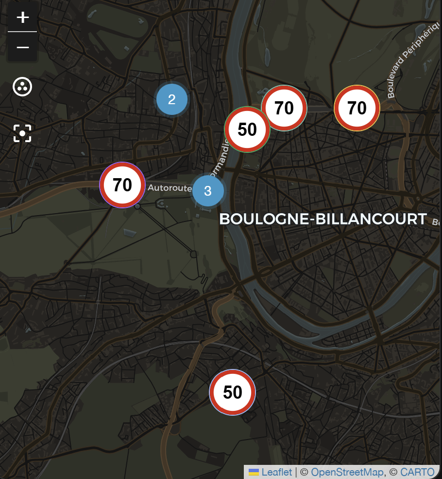
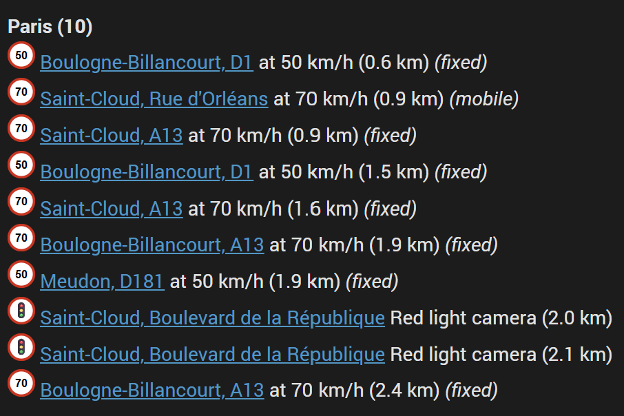

# Lufop Radar Integration for Home Assistant 📡

[](https://github.com/somansch/lufop_radar/releases/latest)
[](https://github.com/hacs/integration)
[](LICENSE)

## Overview

This Home Assistant custom integration reports fixed speed cameras, mobile radar checks, and red light cameras near a configured location, using the [Lufop](https://lufop.net) radar database — a free, officially documented API covering 20+ countries. Unlike some other radar data sources, Lufop's API is meant to be used by third-party developers: it just requires a free, personal API key.

Each detected radar is exposed as a `geo_location` entity, so it shows up natively on the [map card](https://www.home-assistant.io/dashboards/map/), and a running total is exposed as a sensor.

**Tested scope:** this integration has so far only been tested against Lufop's free plan, which covers **France, Belgium, and Switzerland** (see [Getting an API key](#getting-an-api-key) below). Lufop documents 20+ countries in total, but those are only confirmed reachable on a paid plan and haven't been tested here - all examples in this README use French/Belgian/Swiss cities accordingly.

## Dashboard Examples

### Map card



Each detected radar's `entity_picture` is a generated speed-limit-sign image (or a traffic-light sign for red-light cameras), so it renders directly as the map marker instead of a generic dot. Each configured area/route gets its own `source`, named `lufop_radar_<area>` (e.g. `lufop_radar_paris`), so you can show just one area on a map card instead of all of them combined:

```yaml
type: map
geo_location_sources:
  - lufop_radar_paris
```

Use `geo_location_sources: [all]` (or list every `lufop_radar_<area>` source) to show all configured areas on the same map.

### Markdown card



The list is sorted by distance to the area's center point, closest first, each entry linking to its Lufop detail page:

```jinja2
<h1></h1>












<b>{{ area }} ({{ sorted_items | count }})</b><br>




<a href="https://lufop.net/detail/{{ state_attr(e, 'id') }}/">{{ state_attr(e, 'city') }}, {{ state_attr(e, 'street') }}</a>

&nbsp;Red light camera ({{ states(e) }} km)

&nbsp;at {{ state_attr(e, 'speed') }} km/h ({{ states(e) }} km)


&nbsp;<i>(fixed)</i>

&nbsp;<i>(mobile)</i>

<br>





<div style="text-align:center; opacity:0.7;">
  No speed cameras right now 🚗💨
</div>

```

## Getting an API key

Lufop requires a personal API key before you can use the integration:

1. Go to [api.lufop.net](https://api.lufop.net/#apiAccessForm) and fill out the request form (country, name, email, organization, project description, intended use). Requests appear to be reviewed manually, so approval isn't instant.
2. Once approved, you'll receive your key and access to a usage dashboard.
3. Enter that key in the config flow below.

The free plan is capped at 200 requests/day, 10 requests/minute, and 200 results per request, and doesn't support querying all countries at once - each request is scoped to a single country. This integration is built around those limits: requests are automatically spaced out (at least ~6.5 seconds apart across every configured area/route sharing the API key) to stay under the per-minute cap, and each area or route polls only often enough to stay comfortably under 200 requests/day - by default every 10 minutes for an area, or longer for a route (proportional to how many points it needs to sample). Adding more areas/routes on the same key shares that same daily budget, so the safety margin shrinks with each additional entry.

**The free plan only covers France, Belgium, and Switzerland** - selecting any other country (even though it's offered in the picker, for accounts on a paid plan) fails with a "country not allowed" error from Lufop. Check your plan's allowed countries on your [Lufop dashboard](https://api.lufop.net/) before configuring an area, or upgrade if you need a country outside those three.

## Installation

### HACS (recommended)

1. Install HACS if you don't have it already
2. Open HACS in Home Assistant
3. Go to any of the sections (integrations, frontend, automation)
4. Click on the 3 dots in the top right corner
5. Select "Custom repositories"
6. Add the following URL to the repository: `https://github.com/somansch/lufop_radar`
7. Select "Integration" as category
8. Click the "ADD" button
9. Search for "Lufop Radar"
10. Click the "Download" button

### Manual

Download `lufop_radar.zip` from the [latest release](https://github.com/somansch/lufop_radar/releases/latest) and extract its contents to the `config/custom_components/lufop_radar` directory:

```bash
mkdir -p custom_components/lufop_radar
cd custom_components/lufop_radar
wget https://github.com/somansch/lufop_radar/releases/latest/download/lufop_radar.zip
unzip lufop_radar.zip
rm lufop_radar.zip
```

## Configuration

### Adding an area or route

From the Home Assistant front page, go to **Settings** and then select **Devices & Services** from the list. Use the **Add Integration** button in the bottom right, search for "Lufop Radar" and add your first entry. The integration itself is only added once — to track additional areas/routes, open the already-added "Lufop Radar" integration card and use its own **Add entry** option to create another entry, each with its own entities.

The first step asks for a display name and a **search mode**:

- **Area (radius)** — the classic mode: one center point plus a radius circle.
- **Route (waypoints)** — search a corridor along a hand-drawn route instead (see below).

The config wizard is available in English, German, and French, matching whichever language Home Assistant is set to for the current user.

#### Area (radius)

| Field | Description |
|---|---|
| **Display name** | Freely chosen name for this area. Used as a suffix in entity names and IDs, and as the `area` attribute on every `geo_location` entity it creates. |
| **Section** | Drag the map to the center point you want to monitor and adjust the radius circle. All radars within this radius are reported. |
| **API key** | Your personal Lufop API key (see [Getting an API key](#getting-an-api-key)). |
| **Country** | The country to query, shown by name and sorted alphabetically (Lufop scopes each request to a single country on the free plan). |
| **Types** – Fixed | Include permanently installed fixed speed cameras. |
| **Types** – Mobile | Include mobile radar checks. In countries without a separate "mobile" listing (e.g. France), this also includes Lufop's "Chantier" entries - mobile radar units deployed in roadwork zones, not the roadwork itself. |
| **Types** – Red light | Include red light cameras. |
| **Optional settings** – Maximum number of radars | Upper limit on how many radars are tracked at once (default 9). |
| **Optional settings** – Update interval (minutes, 0 = manual only) | How often this area polls Lufop. Defaults to 10 minutes; **0** disables automatic polling entirely - use the [`lufop_radar.refresh` service](#on-demand-refresh--automation-example) instead. Not a hard quota-safe limit: see the requests/day math above before lowering it, especially with several areas/routes on one key. |
| **Optional settings** – Whitelist (comma-separated city names) | Comma-separated list of city names to keep, case-insensitive exact match (e.g. `Strasbourg,Colmar`). Empty (the default) means no filtering — every city is kept. |
| **Optional settings** – Blacklist | Comma-separated list of radar IDs to always exclude, regardless of the whitelist (e.g. `12345,67890`). The ID is the radar's `id` attribute. |

#### Route (waypoints)

For a commute or a regular trip, "area" search would need an impractically large radius. Route mode instead lets you draw the route as a chain of waypoints, one map at a time — the same drag-the-map interaction as the area's radius picker, just repeated per point instead of one point plus a circle:

1. Move the map to your route's starting point, then leave **Add another waypoint** checked and continue — one map screen per waypoint.
2. Add a waypoint at every place the route bends noticeably. Radars are searched in a corridor along the *straight* line between consecutive waypoints, not along actual roads (there's no routing engine involved), so a long straight line across a curve will miss radars on the curve or search too widely off to the side.
3. Uncheck **Add another waypoint** once you've placed the last one (at least 2 total).
4. Set the **Corridor width (meters)** — how far to each side of the route line to search (default 300 m).
5. The next screen shows how many requests that corridor width needs per poll (see below) and asks for the API key, country, radar-type, and optional-settings fields from the table above. Not happy with the request count? Enable **Adjust corridor width instead of saving** to jump back to step 4 without redrawing the route, then continue again once it looks right.

Internally, the integration interpolates extra sample points along each straight segment (spaced one corridor-width apart) and queries Lufop around every one of them, then merges and deduplicates the results by radar ID. So the number of requests a poll needs depends on both the corridor width *and* the distance between waypoints, not just the number of waypoints - e.g. two waypoints 2 km apart with a 100 m corridor interpolates to 21 sample points (`int(2000 // 100) + 1`), i.e. 21 requests per poll. The wizard shows this exact count, plus the resulting suggested **Update interval**, for your own route before you save.

Editing a route via **Configure** first asks **what to edit**:

- **Edit waypoints** — steps you through every already-saved waypoint one at a time (move the map to reposition it, or check **Remove this waypoint** to drop it), then lets you append further new waypoints to the end. The route isn't discarded and redrawn from scratch.
- **Edit search settings** — jumps straight to corridor width, API key, country, radar types, and the optional settings, without touching the waypoints at all.

Every field above can be changed afterwards: go to **Settings → Devices & Services**, find the entry for the area/route you want to change, and click **Configure**.

### On-demand refresh & automation example

Every area/route has an **Update interval** (see the tables above); setting it to **0** turns off automatic polling entirely, so it only ever refreshes when *you* ask it to - via the **`lufop_radar.refresh`** action ("Lufop Refresh" in the UI). Call it targeting the area/route you want, and it immediately fetches the latest radars, creates/updates/removes that entry's `geo_location` entities exactly like a normal scheduled poll would, and (optionally) returns the radars found so an automation can use them directly.

A common use case: a route for your commute, set to manual-only, refreshed and sent to your phone the moment you actually leave home - instead of polling every few minutes all day for a route you only drive once or twice:

```yaml
automation:
  - alias: "Send commute radars when leaving home"
    triggers:
      - trigger: zone
        entity_id: person.your_name
        zone: zone.home
        event: leave
    actions:
      - action: lufop_radar.refresh
        data:
          config_entry_id: YOUR_ROUTE_CONFIG_ENTRY_ID
        response_variable: commute_radars
      - action: notify.whatsapp   # whichever WhatsApp notify service you have set up (e.g. a CallMeBot or Twilio integration) - not a built-in Home Assistant service
        data:
          message: >-
            
            🚨 {{ commute_radars.radars | count }} radar(s) on your commute:
            
            - {{ r.city }}, {{ r.street }} ({{ r.speed }} km/h)
            
            
            No radars currently reported on your commute. Safe drive!
            
```

Find `YOUR_ROUTE_CONFIG_ENTRY_ID` under **Settings → Devices & Services**, click the "Lufop Radar" integration, open the route's entry, and copy its ID from the browser's URL - or just build the action once in **Developer Tools → Actions**, picking the route from the "Area or route" dropdown, then switch to YAML mode there to copy the resolved `config_entry_id`.

### Created entities

Each area or route produces the following entities:

| Entity | Description |
|---|---|
| Total count sensor (`sensor.*`) | Number of currently reported radars (capped at "Maximum number of radars"). Its attributes break the count down per city. |
| One `geo_location` entity per radar (`geo_location.*`) | Created and removed dynamically as radars appear and disappear from the live data — there's no fixed pool of entities. |

Attributes on each radar's `geo_location` entity:

| Attribute | Description |
|---|---|
| `state` | Distance in km (or miles) to the nearest reference point — the area's center point in area mode, or the nearest of the route's waypoints in route mode. |
| `source` | `lufop_radar_<area>`, e.g. `lufop_radar_strasbourg`. Lets a map card select one specific area via `geo_location_sources`. |
| `area` | The display name you gave this area. |
| `type` | One of `fixed`, `mobile`, or `redlight`. |
| `id` | The radar's Lufop ID, also usable for the blacklist option. |
| `speed` | Speed limit at this location. |
| `city`, `street` | Address of the radar (`commune`/`voie` in Lufop's data). |
| `country` | Country code as reported by Lufop. |
| `flash_direction` | Flash direction: `front`, `back`, or `both`. |
| `azimuth` | Compass bearing (0-360). |
| `updated` | Last update timestamp from Lufop. |

## Help and Contribution

If you find a problem, feel free to open an issue and I will do my best to help. If you have something to contribute, your help is greatly appreciated! If you want to add a new feature, please open a pull request first so we can discuss the details.

## Disclaimer

This custom integration is not officially affiliated with Lufop. Data is provided by [Lufop](https://lufop.net) under a [CC BY-SA 4.0](https://creativecommons.org/licenses/by-sa/4.0/) license, which permits commercial use with attribution. Unlike some other radar data sources, Lufop's API is an intentional, documented developer offering rather than a reverse-engineered endpoint — but you still need your own API key, and should review [Lufop's terms](https://api.lufop.net/) for your specific use case.
